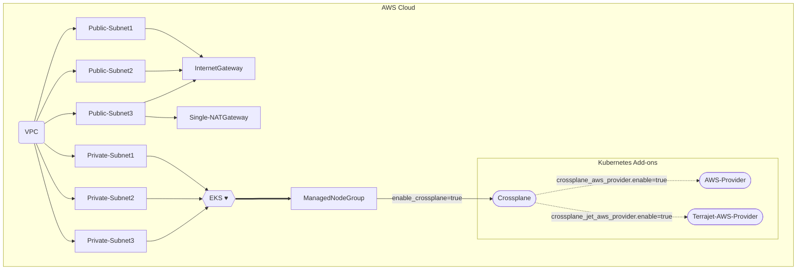

# Crossplane Add-on

This example deploys the following Basic EKS Cluster with VPC

- Creates a new sample VPC, 3 Private Subnets and 3 Public Subnets
- Creates Internet gateway for Public Subnets and NAT Gateway for Private Subnets
- Creates EKS Cluster Control plane with one managed node group
- Crossplane Add-on to EKS Cluster
- AWS Provider for Crossplane
- Terrajet AWS Provider for Crossplane

## Crossplane Design



## How to Deploy

### Prerequisites:

Ensure that you have installed the following tools in your Mac or Windows Laptop before start working with this module and run Terraform Plan and Apply

1. [AWS CLI](https://docs.aws.amazon.com/cli/latest/userguide/install-cliv2.html)
2. [Kubectl](https://Kubernetes.io/docs/tasks/tools/)
3. [Terraform](https://learn.hashicorp.com/tutorials/terraform/install-cli)

### Deployment Steps

#### Step 1: Clone the repo using the command below

```shell script
git clone https://github.com/aws-ia/terraform-aws-eks-blueprints.git
```

#### Step 2: Run Terraform INIT

Initialize a working directory with configuration files

```shell script
cd examples/crossplane/
terraform init
```

#### Step 3: Run Terraform PLAN

Verify the resources created by this execution

```shell script
export AWS_REGION=<ENTER YOUR REGION>   # Select your own region
terraform plan
```

#### Step 4: Finally, Terraform APPLY

to create resources

```shell script
terraform apply
```

Enter `yes` to apply

### Configure `kubectl` and test cluster

EKS Cluster details can be extracted from terraform output or from AWS Console to get the name of cluster.
This following command used to update the `kubeconfig` in your local machine where you run kubectl commands to interact with your EKS Cluster.

#### Step 5: Run `update-kubeconfig` command

`~/.kube/config` file gets updated with cluster details and certificate from the below command

```shell script
aws eks --region <enter-your-region> update-kubeconfig --name <cluster-name>
```

#### Step 6: List all the worker nodes by running the command below

```shell script
kubectl get nodes
```

#### Step 7: List all the pods running in `crossplane` namespace

```shell script
kubectl get pods -n crossplane
```

### AWS Provider for Crossplane

This example shows how to deploy S3 bucket using Crossplane AWS provider

- Open the file below

```shell script
vi ~/examples/crossplane/crossplane-aws-examples/aws-provider-s3.yaml
```

- Edit the below `aws-provider-s3.yaml` to update the new bucket name

- Enter the new `bucket name` and `region` in YAML file. Save the file using :wq!

- Apply the K8s manifest

```shell script
cd ~/examples/crossplane/crossplane-aws-examples/
kubectl apply -f aws-provider-s3.yaml
```

- Login to AWS Console and verify the new S3 bucket

To Delete the bucket

```shell script
cd ~/examples/crossplane/crossplane-aws-examples/
kubectl delete -f aws-provider-s3.yaml
```

### Terrajet AWS Provider for Crossplane

This example shows how to deploy S3 bucket using Crossplane Terrajet AWS Provider

- Open the file below

```shell script
vi ~/examples/crossplane/crossplane-aws-examples/jet-aws-provider-s3.yaml
```

- Edit the below `jet-aws-provider-s3.yaml` to update the new bucket name

- Enter the new `bucket name` and `region` in YAML file. Save the file using :wq!

- Apply the K8s manifest

```shell script
cd ~/examples/crossplane/crossplane-aws-examples/
kubectl apply -f jet-aws-provider-s3.yaml
```

- Login to AWS Console and verify the new S3 bucket

To Delete the bucket

```shell script
cd ~/examples/crossplane/crossplane-aws-examples/
kubectl delete -f jet-aws-provider-s3.yaml
```

## How to Destroy

The following command destroys the resources created by `terraform apply`

Step 1: Delete resources created by Crossplane

Step 2: Terraform Destroy

```shell script
cd examples/crossplane
terraform destroy --auto-approve
```
