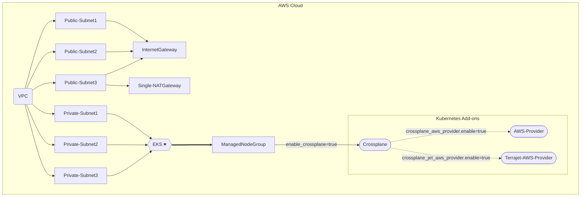

# Crossplane Add-on
This example deploys the following Basic EKS Cluster with VPC
 - Creates a new sample VPC, 3 Private Subnets and 3 Public Subnets
 - Creates Internet gateway for Public Subnets and NAT Gateway for Private Subnets
 - Creates EKS Cluster Control plane with one managed node group
 - Crossplane Add-on to EKS Cluster
 - AWS Provider for Crossplane
 - Terrajet AWS Provider for Crossplane

## Crossplane Design



## How to Deploy
### Prerequisites:
Ensure that you have installed the following tools in your Mac or Windows Laptop before start working with this module and run Terraform Plan and Apply
1. [AWS CLI](https://docs.aws.amazon.com/cli/latest/userguide/install-cliv2.html)
3. [Kubectl](https://Kubernetes.io/docs/tasks/tools/)
4. [Terraform](https://learn.hashicorp.com/tutorials/terraform/install-cli)

### Deployment Steps
#### Step1: Clone the repo using the command below

```shell script
git clone https://github.com/aws-samples/aws-eks-accelerator-for-terraform.git
```

#### Step2: Run Terraform INIT
Initialize a working directory with configuration files

```shell script
cd examples/crossplane/
terraform init
```

#### Step3: Run Terraform PLAN
Verify the resources created by this execution

```shell script
export AWS_REGION=<ENTER YOUR REGION>   # Select your own region
terraform plan
```

#### Step4: Finally, Terraform APPLY
to create resources

```shell script
terraform apply
```

Enter `yes` to apply

### Configure `kubectl` and test cluster
EKS Cluster details can be extracted from terraform output or from AWS Console to get the name of cluster.
This following command used to update the `kubeconfig` in your local machine where you run kubectl commands to interact with your EKS Cluster.

#### Step5: Run `update-kubeconfig` command

`~/.kube/config` file gets updated with cluster details and certificate from the below command

```shell script
aws eks --region <enter-your-region> update-kubeconfig --name <cluster-name>
```

#### Step6: List all the worker nodes by running the command below

```shell script
kubectl get nodes
```

#### Step7: List all the pods running in `crossplane` namespace

```shell script
kubectl get pods -n crossplane
```

### AWS Provider for Crossplane
This example shows how to deploy S3 bucket using Crossplane AWS provider

 - Open the file below

```shell script
vi ~/examples/crossplane/crossplane-aws-examples/aws-provider-s3.yaml
```
 - Edit the below `aws-provider-s3.yaml` to update the new bucket name

 - Enter the new `bucket name` and `region` in YAML file. Save the file using :wq!

 - Apply the K8s manifest

```shell script
cd ~/examples/crossplane/crossplane-aws-examples/
kubectl apply -f aws-provider-s3.yaml
```

 - Login to AWS Console and verify the new S3 bucket

To Delete the bucket
```shell script
cd ~/examples/crossplane/crossplane-aws-examples/
kubectl delete -f aws-provider-s3.yaml
```
### Terrajet AWS Provider for Crossplane
This example shows how to deploy S3 bucket using Crossplane Terrajet AWS Provider

 - Open the file below

```shell script
vi ~/examples/crossplane/crossplane-aws-examples/jet-aws-provider-s3.yaml
```
 - Edit the below `jet-aws-provider-s3.yaml` to update the new bucket name

 - Enter the new `bucket name` and `region` in YAML file. Save the file using :wq!

 - Apply the K8s manifest

```shell script
cd ~/examples/crossplane/crossplane-aws-examples/
kubectl apply -f jet-aws-provider-s3.yaml
```

 - Login to AWS Console and verify the new S3 bucket

To Delete the bucket
```shell script
cd ~/examples/crossplane/crossplane-aws-examples/
kubectl delete -f jet-aws-provider-s3.yaml
```

## How to Destroy
The following command destroys the resources created by `terraform apply`

Step1: Delete resources created by Crossplane

Step2: Terraform Destroy

```shell script
cd examples/crossplane
terraform destroy --auto-approve
```

---

<!--- BEGIN_TF_DOCS --->
## Requirements

| Name | Version |
|------|---------|
| <a name="requirement_terraform"></a> [terraform](#requirement\_terraform) | >= 1.0.1 |
| <a name="requirement_aws"></a> [aws](#requirement\_aws) | >= 3.66.0 |
| <a name="requirement_helm"></a> [helm](#requirement\_helm) | >= 2.4.1 |
| <a name="requirement_kubectl"></a> [kubectl](#requirement\_kubectl) | >= 1.13.1 |
| <a name="requirement_kubernetes"></a> [kubernetes](#requirement\_kubernetes) | >= 2.6.1 |

## Providers

| Name | Version |
|------|---------|
| <a name="provider_aws"></a> [aws](#provider\_aws) | >= 3.66.0 |

## Modules

| Name | Source | Version |
|------|--------|---------|
| <a name="module_aws-eks-accelerator-for-terraform"></a> [aws-eks-accelerator-for-terraform](#module\_aws-eks-accelerator-for-terraform) | ../.. | n/a |
| <a name="module_aws_vpc"></a> [aws\_vpc](#module\_aws\_vpc) | terraform-aws-modules/vpc/aws | v3.2.0 |
| <a name="module_kubernetes-addons"></a> [kubernetes-addons](#module\_kubernetes-addons) | ../../modules/kubernetes-addons | n/a |

## Resources

| Name | Type |
|------|------|
| [aws_availability_zones.available](https://registry.terraform.io/providers/hashicorp/aws/latest/docs/data-sources/availability_zones) | data source |
| [aws_eks_cluster.cluster](https://registry.terraform.io/providers/hashicorp/aws/latest/docs/data-sources/eks_cluster) | data source |
| [aws_eks_cluster_auth.cluster](https://registry.terraform.io/providers/hashicorp/aws/latest/docs/data-sources/eks_cluster_auth) | data source |
| [aws_region.current](https://registry.terraform.io/providers/hashicorp/aws/latest/docs/data-sources/region) | data source |

## Inputs

No inputs.

## Outputs

No outputs.

<!--- END_TF_DOCS --->
