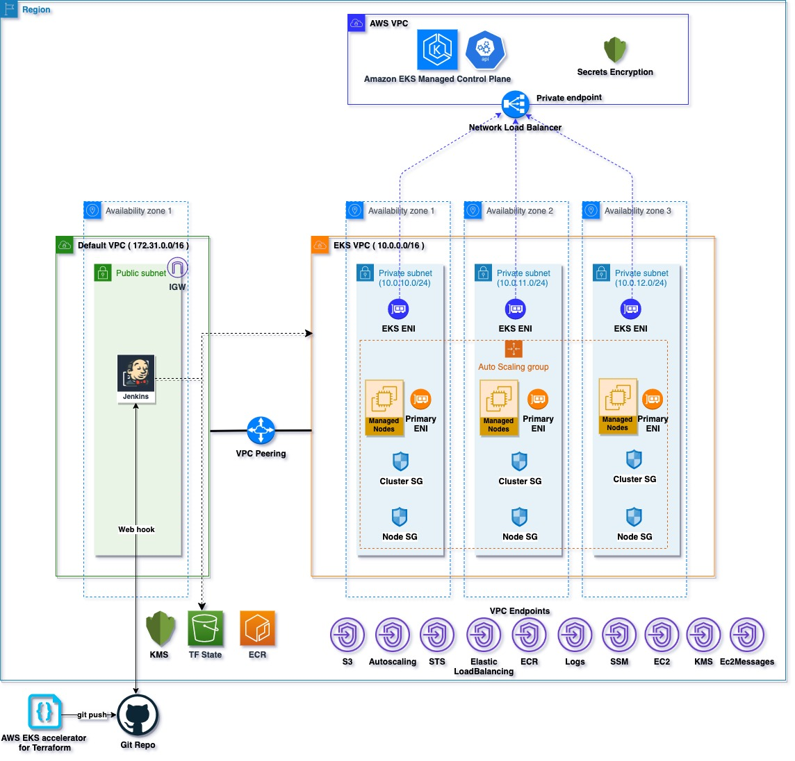

# Fully Private EKS Cluster with VPC and VPC Endpoints deployment

This example deploys a fully private EKS Cluster into a new VPC using Cloud9 running on its on VPC. The Cloud9 instance and the Cloud9 VPC represents a development/deployment environment. This environment can be replaced by Direct Connect/VPN connection with an on-premises environment.
 - Create a new VPC called cloud9-vpc with public and private subnets to host the Cloud9 instance.
 - Creates a new VPC called eks-vpc and 3 Private Subnets to deploy the private EKS cluster.
 - VPC Peering connection between the above 2 VPCs and Route table updates to allow network traffic between these 2 VPCs.
 - VPC Endpoints for various services and S3 VPC Endpoint gateway in the eks-vpc that is required for the private EKS cluster.
 - Creates EKS Cluster Control plane with a private endpoint and with one Managed node group.
 - Deploys Amazon EKS add-ons to the EKS cluster.

Please see this [document](https://docs.aws.amazon.com/eks/latest/userguide/private-clusters.html) for more details on configuring fully private EKS Clusters

Here is the high level design of the solution. The solution has been split into 3 different Terraform stacks for simplicity.
1. VPC
    - This Terraform stack provisions the following resources :
        - A VPC (cloud9-vpc) with public and private subnets to run the Cloud9 Instance.
        - A VPC (eks-vpc) with private only subnets to run the EKS cluster with VPC endpoints.
        - A VPC peering connection to peer the 2 VPCs
        - Route table updates to allow network traffic from the cloud9-vpc to the eks-vpc.
2. EKS
    - This Terraform stack provision a private EKS cluster in the eks-vpc.
3. Add-ons
    - This Terraform stack provisions managed add-ons to the EKS cluster.



## How to Deploy
### Prerequisites:
Ensure that you have installed the following tools in your Mac or Windows Laptop before start working with this module and run Terraform Plan and Apply
1. [AWS CLI](https://docs.aws.amazon.com/cli/latest/userguide/install-cliv2.html)
2. [Kubectl](https://Kubernetes.io/docs/tasks/tools/)
3. [Terraform](https://learn.hashicorp.com/tutorials/terraform/install-cli)

# Provision the VPC and network plumbing using the VPC stack
### Deployment Steps
#### Step1: Clone the repo using the command below

```shell script
git clone https://github.com/aws-ia/terraform-aws-eks-blueprints.git
```

#### Step2: Review and update the base.tfvars
Create a Terraform variable definition file called base.tfvars and update the values for the variables. The following shows an example for the variables for the VPC Terraform Stack.
```shell script
region           = "us-west-2"
eks_vpc_name     = "eks_vpc"
eks_vpc_cidr     = "10.0.0.0/16"
cloud9_vpc_cidr  = "172.31.0.0/16"
cloud9_vpc_name  = "cloud9_vpc"
cloud9_owner_arn = "<arn of the owner>"
```

#### Step3: Run Terraform INIT
Initialize a working directory with configuration files


```shell script
cd examples/fully-private-eks-cluster/vpc
terraform init
```

#### Step4: Run Terraform PLAN
Verify the resources created by this execution

```shell script
export AWS_REGION=<ENTER YOUR REGION>   # Select your own region
terraform plan -var-file base.tfvars
```

#### Step5: Terraform APPLY
to create resources

```shell script
terraform apply -var-file base.tfvars
```

Enter `yes` to apply

Note : Once the stack completes, you will see an output of the vpc-id and the private subnets for the eks-vpc. Note them so we can use them in the EKS Terraform stack.


### How to Destroy
The following command destroys the resources created by `terraform apply`

```shell script
cd examples/fully-private-eks-cluster/vpc
terraform destroy -var-file base.tfvars -auto-approve  
```  

# Provision the Private EKS cluster using the EKS stack.

### Prerequisites:
We will deploy the EKS cluster from the Cloud9 instance that was deployed to the cloud9-vpc.

1. Launch the "EKS-Cloud9" Cloud9 instance.
2. Install Kubernetes tools on the Cloud9 instance.
   - [Kubectl](https://Kubernetes.io/docs/tasks/tools/)
3. Create an IAM role for the Cloud9 workspace and attach the IAM role to your workspace. This IAM role should have enough permissions to provision an EKS cluster:
   - [Create an IAM role for your Workspace](https://www.eksworkshop.com/020_prerequisites/iamrole/)
   - [Attach the IAM role to your Workspace](https://www.eksworkshop.com/020_prerequisites/ec2instance/)
4. Update IAM settings for your workspace to disable Cloud9 managing IAM credentials.
```shell script
aws cloud9 update-environment  --environment-id $C9_PID --managed-credentials-action DISABLE
rm -vf ${HOME}/.aws/credentials
```
> This page ([Update IAM settings for your Workspace](https://www.eksworkshop.com/020_prerequisites/workspaceiam/)) contains the above step and also some useful addition steps to save the AccountId and default Region into your bash_profile.

5. From the Cloud9 bash teminal, ensure that your Cloud9 instance ARN shows the assumed-role that matches the IAM role you assigned to the EC2 instance:
```shell script
aws sts get-caller-identity --query Arn
```
The output should look something like `"arn:aws:sts::<AccountId>:assumed-role/<RoleName>/<instanceId>"`

> You can find your instanceId on the Cloud9 instance with this command `curl -s http://169.254.169.254/latest/meta-data/instance-id`

### Deployment Steps
#### Step1: Clone the repo using the command below

```shell script
git clone https://github.com/aws-ia/terraform-aws-eks-blueprints.git
```

#### Step2: Review and update the base.tfvars
Create a Terraform variable definition file called base.tfvars and update the values for the variable(s).  The following shows an example for the variables for the EKS Terraform stack. Ensure you verify and replace all the values for these variables. You can get the VPC ID and subnet IDs from the VPC stack output.

```shell script
region             = "us-west-2"
cluster_version    = "1.22"
vpc_id             = "<vpc-id>"
private_subnet_ids = ["<private-subnet-1>", "<private-subnet-2>", "<private-subnet-3>"]
cluster_security_group_additional_rules = {
  ingress_from_cloud9_host = {
    description = "Ingress from  Cloud9 Host"
    protocol    = "-1"
    from_port   = 0
    to_port     = 0
    type        = "ingress"
    cidr_blocks = ["172.31.0.0/16"]
  }
}
```
#### Step3: Run Terraform INIT
Initialize a working directory with configuration files. Change directory into the cloned repo.

```shell script
cd examples/fully-private-eks-cluster/eks
terraform init
```

#### Step4: Run Terraform PLAN
Verify the resources created by this execution

```shell script
export AWS_REGION=<ENTER YOUR REGION>   # Select your own region
terraform plan -var-file base.tfvars
```

#### Step5: Terraform APPLY
to create resources

```shell script
terraform apply -var-file base.tfvars
```
Enter `yes` to apply

### Configure `kubectl` and test cluster
EKS Cluster details can be extracted from terraform output or from AWS Console to get the name of cluster.
This following command used to update the `kubeconfig` on your Cloud9 instance where you run kubectl commands to interact with your EKS Cluster.

#### Step6: Run `update-kubeconfig` command

`~/.kube/config` file gets updated with cluster details and certificate from the below command

    $ aws eks --region <enter-your-region> update-kubeconfig --name <cluster-name>

The EKS Terraform stack outputs the command you have to execute to update the  `kubeconfig` on your Cloud9 instance.

#### Step7: List all the worker nodes by running the command below

    $ kubectl get nodes

#### Step8: List all the pods running in `kube-system` namespace

    $ kubectl get pods -n kube-system


### How to Destroy
The following command destroys the resources created by `terraform apply`

```shell script
cd examples/fully-private-eks-cluster/eks
terraform destroy -var-file base.tfvars -auto-approve  
```

# Provision the Managed Add-ons using the add-ons stack.

### Deployment Steps

#### Step1: Review and update the base.tfvars
Create a Terraform variable definition file called base.tfvars and update the values for the variable(s).  The following shows an example for the variables used in the add-ons Terraform stack. Ensure you verify and replace all the values for these variables.

```shell script
region         = "us-west-2"
eks_cluster_id = "eks"
cluster_version= "1.22"

```
#### Step2: Run Terraform INIT
Initialize a working directory with configuration files

```shell script
cd examples/fully-private-eks-cluster/add-ons
terraform init
```

#### Step3: Run Terraform PLAN
Verify the resources created by this execution

```shell script
export AWS_REGION=<ENTER YOUR REGION>   # Select your own region
terraform plan -var-file base.tfvars
```

#### Step4: Terraform APPLY
to create resources

```shell script
terraform apply -var-file base.tfvars
```
Enter `yes` to apply
### How to Destroy
The following command destroys the resources created by `terraform apply`

```shell script
cd examples/fully-private-eks-cluster/add-ons
terraform destroy -var-file base.tfvars -auto-approve  
```
<!--- END_TF_DOCS --->
