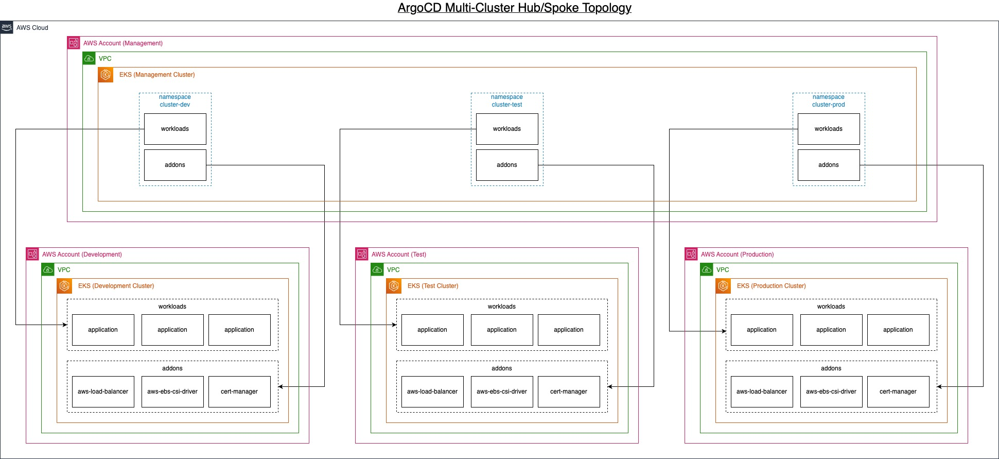
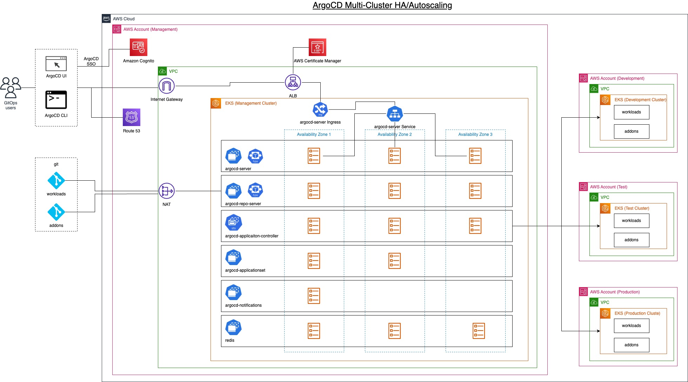

# Multi-cluster EKS with ArgoCD

This example demonstrates how to deploy a single instance of ArgoCD on a central cluster (hub)
managing multiple tenant clusters (spokes).



## Features

- Central and Spoke/Child clusters deployed in different accounts and regions.
- Central GitOps instance deploying addons and workloads to spoke/child clusters
- Demonstrate the pattern of the spoke/child cluster template terraform module.
- Each spoke/child cluster can select a different set of addons
- Demonstrate GitOps Application patterns, app of apps, single app, and application-sets.
- ArgoCD Application Sets using Cluster generator, cluster are labeled based on environment (i.e. dev, test, prod)
- ArgoCD Ingress configuration with a custom domain name, valid SSL certificate thru AWS ACM, and AWS Route 53 DNS configured with external-dns. Secure login via Web Ui and CLI using HTTPS and grpc (i.e. no need to skip SSL verification)
- ArgoCD High Availability with Auto-scaling (HPA), controller with multiple replicas for cluster sharding. Disable unused components (i.e. dex server).
- Support private git repositories and configuration via ssh private key stored in AWS Secret Manager.
- ArgoCD initial admin password generated and stored in AWS Secret Manager.
- ArgoCD SSO Login with Amazon Cognito. Read the section below for instructions on how to setup Amazon Cognito
- Instructions and `destroy.sh` script to cleanly destroy clusters.


To better understand how ArgoCD works with EKS Blueprints, read the EKS Blueprints ArgoCD [Documentation](https://aws-ia.github.io/terraform-aws-eks-blueprints/latest/add-ons/argocd/)

## Reference Documentation

- [Documentation](https://aws-ia.github.io/terraform-aws-eks-blueprints/latest/add-ons/argocd/)
- [EKS Blueprints Addons Repo](https://github.com/aws-samples/eks-blueprints-add-ons)
- [EKS Blueprints Workloads Repo](https://github.com/aws-samples/eks-blueprints-workloads)


## Prerequisites

Ensure that you have the following tools installed locally:

1. [aws cli](https://docs.aws.amazon.com/cli/latest/userguide/install-cliv2.html)
2. [kubectl](https://Kubernetes.io/docs/tasks/tools/)
3. [terraform](https://learn.hashicorp.com/tutorials/terraform/install-cli)
4. [argocd cli](https://argo-cd.readthedocs.io/en/stable/cli_installation/)


# Deploy

### (Optional) Ingress
The example supports ArgoCD UI configuration with a valid domain name (ie. example.com) or LoadBalancer with a generated domain name.
To use the Ingress, you must create a Route 53 Hosted zone, and configure ACM with the domain name.
You will be able to use ArgoCD with a valid SSL certificate on a domain (i.e. argocd.example.com)
You can use a registered domain you control or register a new one following the instructions [here](https://aws.amazon.com/getting-started/hands-on/get-a-domain/).

To enable this option, use:
```sh
export TF_VAR_enable_ingress=true
```

**Create DNS Hosted Zone in Route 53:**

In this step you will delegate your registered domain DNS to Amazon Route53. You can either delegate the top level domain or a subdomain.
```
export TF_VAR_domain_name=<my-registered-domain> # For example: example.com or subdomain.example.com
```
You can use the Console, or the `aws` cli to create a hosted zone. Execute the following command only once:
```sh
aws route53 create-hosted-zone --name $TF_VAR_domain_name --caller-reference "$(date)"
```
Use the NameServers in the DelegatoinSet to update your registered domain NS records at the registrar.

## Deploy Hub Cluster
After selecting LoadBalancer or Ingress for ArgoCD, deploy the Hub Cluster
```sh
cd hub-cluster
terraform init
terraform apply -auto-approve
cd ..
```

## Configure kubectl for Hub Cluster
Login with kubectl to Hub Cluster
```sh
terraform -chdir=hub-cluster output -raw configure_kubectl
```
Expected output, run the `aws eks update-kubeconfig` command
```
aws eks update-kubeconfig --name hub-cluster --region us-west-2
```


## Update Spoke Cluster Template

You can edit the file [spoke-cluster-template/main.tf](./spoke-cluster-template/main.tf) to change the configuration of the spoke clusters.

(Optional) Each spoke cluster deploys a different set of Cluster addons and applications. See the `main.tf` for each spoke cluster to review the configuration.

(Optional) You have the option to create clusters in different accounts or regions than the hub cluster,
inspect the `main.tf` to pass the optional parameters.
```hcl
spoke_profile = "account-spoke-Admin"
spoke_region  = "us-east-1"
hub_profile   = "account-hub-Admin"
hub_region    = "us-west-2"
```

The Spoke clusters can be deployed in parallel.

## Deploy Spoke Cluster 1 "DEV"
```sh
cd spoke-cluster-1-dev
terraform init
terraform apply -auto-approve
cd ..
```

## Deploy Spoke Cluster 2 "TEST"
```sh
cd spoke-cluster-2-test
terraform init
terraform apply -auto-approve
cd ..
```

## Deploy Spoke Cluster 2 "PROD"
```sh
cd spoke-cluster-2-prod
terraform init
terraform apply -auto-approve
cd ..
```

## Validate

### Access ArgoCD
Get ArgoCD URL and Password if using Ingress
```sh
echo "URL: https://$(kubectl get ing -n argocd argo-cd-argocd-server -o jsonpath='{.spec.tls[0].hosts[0]}')"
echo "Username: admin"
echo "Password: $(kubectl get secrets argocd-initial-admin-secret -n argocd --template="{{index .data.password | base64decode}}")"
```
Get ArgoCD URL and Password if using LoadBalancer and not Ingress
```sh
echo "URL: https://$(kubectl get svc -n argocd argo-cd-argocd-server -o jsonpath='{.status.loadBalancer.ingress[0].hostname}')"
echo "Username: admin"
echo "Password: $(kubectl get secrets argocd-initial-admin-secret -n argocd --template="{{index .data.password | base64decode}}")"
```

Expected output:
```
URL: https://argocd.example.com
Username: admin
Password: SecretString: **********
```

### Login into ArgoCD UI
Login into ArgoCD UI using the url, username, and password

Go to Settings->Clusters; you should see three remote clusters:
  - `cluster-dev`  is the Spoke Cluster 1 "DEV"
  - `cluster-test` is the Spoke Cluster 2 "TEST"
  - `cluster-prod` is the Spoke Cluster 3 "PROD"

## Login into ArgoCD CLI
You can access ArgoCD using the `argo` CLI
Download the latest Argo CD version from https://github.com/argoproj/argo-cd/releases/latest. See [CLI installation documentation](https://argo-cd.readthedocs.io/en/stable/cli_installation/).

Log in using `argo login` using the hostname, username, and password.
```sh
argo login argocd login argocd.${TF_VAR_argo_domain} --username admin
```
List the spoke clusters
```sh
argocd cluster list
```
You can list based on cluster labels using `kubectl`
```sh
kubectl get secrets -n argocd -l environment=dev,argocd.argoproj.io/secret-type=cluster
```

## Grafana
You can view the ArgoCD metrics using Grafana.
Get Grafana URL and Password if using LoadBalancer and not Ingress
```sh
echo "URL: http://$(kubectl get svc grafana -n grafana -o jsonpath='{.status.loadBalancer.ingress[0].hostname}')"
echo "Username: $(kubectl get secrets grafana -n grafana --template="{{index .data \"admin-user\" | base64decode}}")"
echo "Password: $(kubectl get secrets grafana -n grafana --template="{{index .data \"admin-password\" | base64decode}}")"
```
Select the ArgoCD dashboard that is loaded pre-loaded

## (Optional) Private git repositories
To use private git repositories, you can use SSH authentication.

1. Create the secret key `github-ssh-key` within Secret Manager
containing the private SSH key in plain text. This key is specified using the variable `ssh_key_secret_name` in [spoke-cluster-template/main.tf](./spoke-cluster-template/main.tf)
2. Edit the file [spoke-cluster-template/main.tf](./spoke-cluster-template/main.tf) and specify the git url using SSH notation (ie git@gitub.com/<user_or_org>/<repository>).
The variables `git_secret_namespace` and `git_secret_name` store the git configuration in the Hub Cluster.

For more information, see [ArgoCD SSH git authentication](https://argo-cd.readthedocs.io/en/stable/operator-manual/declarative-setup/#repositories)
```hcl
repo_url             = "git@gitub.com/<user_or_org>/<repository>"
ssh_key_secret_name  = "github-ssh-key"
git_secret_namespace = "argocd"
git_secret_name      = "${local.name}-addons"
```

## Destroy

### Destroy Spoke Cluster 1 "DEV"
```sh
cd spoke-cluster-1-dev
./destroy.sh
cd ..
```

### Destroy Spoke Cluster 2 "TEST"
```sh
cd spoke-cluster-2-test
./destroy.sh
cd ..
```

### Destroy Spoke Cluster 3 "PROD"
```sh
cd spoke-cluster-2-prod
./destroy.sh
cd ..
```

### Destroy Hub Cluster
```sh
cd hub-cluster
./destroy.sh
cd ..
```
>The above `./destroy.sh` command deletes the Ingress before uninstalling the argocd server, the Ingress depends on the aws-loadbalancer-controller addon being deployed via gitops using argocd application. The following command runs before any `terraform destroy runs` in the `destroy.sh` script.
```sh
kubectl delete ing argo-cd-argocd-server -n argocd
```

## (Optional) ArgoCD SSO login with Amazon Cognito

You can configure SSO Login for ArgoCD Web UI and CLI. ArgoCD supports integration with an existing [OIDC provider](https://argo-cd.readthedocs.io/en/stable/operator-manual/user-management/#existing-oidc-provider) such as [Amazon Cognito](https://aws.amazon.com/cognito/).


### UserPool configuration

* You have a Cognito UserPool created (if not yet, make one right now, stick to the defaults if you do it through AWS Console). Note the `Pool Id`. We are going to use it later.
* Create an app client per the correspondent Argo application.
* Configure an app client per the correspondent Argo application.
  * In `Enabled Identity Providers` select `Cognito User Pool`
  * In `Callback URL(s)` specify `https://${your-ARGOCD-fqdn}/auth/callback`
  * In `Sign out URL(s)` specify `https://${your-ARGOCD-fqdn}/logout`
  * In `Allowed OAuth Flows` select `Authorization code grant`
  * In `Allowed OAuth Scopes` select `email`, `openid`, `profile`
  * Save Changes
* Configure the domain name. It would be best if you had it for the authentication flow to work.
  * For this guide, use `Amazon Cognito domain` with a custom `Domain prefix`, and set any value there. Cognito will use it to redirect you to your UserPoll Sign-In page. It is OK to use your domain as well, but its config is out of the scope of this guide. Take note of the field.

### CLI authentication

We need another secret-less **client application** in the Cognito user pool. Go and create one in AWS Console. Just make sure `Generate client secret` option is not selected. Please take note of it's client ID.
Now configure this client app. Let's make sure the following is selected:
* In `Enabled Identity Providers` select `Cognito User Pool`
* In `Callback URL(s)` specify `http://localhost:8085/auth/callback`
* In `Allowed OAuth Flows` select `Authorization code grant`
* In `Allowed OAuth Scopes` select `email`, `openid`, `profile`
* Save Changes

### RBAC

Add a user to the user pool, then create groups `argocd-admin` and `argocd-readonly` and add the users to each corresponding group. Add the user you just added to the `argocd-admin` to allow admin tasks in ArgoCD.

The group names can be change in [./hub-cluster/cognito.yaml](./hub-cluster/cognito.yaml)

```yaml
configs:
  rbac:
    policy.csv: |
      g, argocd-admin, role:admin
      g, argocd-readonly, role:readonly
    scopes: '[cognito:groups]'
```
ArgoCD built-in roles are `role:admin` and `role:readonly` additional policies can be added see [ArgoCD RBAC documentation](https://argo-cd.readthedocs.io/en/stable/operator-manual/rbac/)

### CLI Login
Log in with the Argo CLI using the command  `argocd login https://myargocd.acme.com --sso`.

### Disable Dex
ArgoCD also supports SSO using [Bundled Dex OIDC provider](https://argo-cd.readthedocs.io/en/stable/operator-manual/user-management/#dex)
Since we are not using dex, the example disables dex in ArgoCD.


### Deploy Hub Cluster with ArgoCD SSO

Collect the following information from Amazon Cognito User Pool:
* your UserPool IDP endpoint - it follows this schema `https://cognito-idp.${aws-region}.amazonaws.com/${UserPool-ID}`. For example `https://cognito-idp.us-east-1.amazonaws.com/us-east-1_uTZRXY6BL`
* your ArgoCD app client Logout URL. For exaxmple `https://{client-app-name}.auth.{aws-region}.amazoncognito.com/logout`
* your ArgoCD app client ID. For example: `67dted0oitvupuubmah32ar10s`
* your ArgoCD app client Secret. For example: `dp9cvv8f055pt99203aos3iota0ci7up96dgmfdi1eu03c569hj`.
* your ArgoCD CLI app client ID. For example, `5oq67qgtjmpc2sqjjn88puj477`

Set the following Terraform Variables, for example
```sh
export TF_VAR_argocd_enable_sso=true
export TF_VAR_enable_ingress=true
export TF_VAR_argocd_domain="example.com" # See instructions above to configure Route 53 zone, and ACM Certificate
export TF_VAR_argocd_sso_issuer="https://cognito-idp.us-west-2.amazonaws.com/us-west-2_voJm3sI8d"
export TF_VAR_argocd_sso_client_id="67dted0oitvupuubmah32ar10s"
export TF_VAR_argocd_sso_client_secret="dp9cvv8f055pt99203aos3iota0ci7up96dgmfdi1eu03c569hj"
export TF_VAR_argocd_sso_logout_url="https://argocd.auth.us-west-2.amazoncognito.com/logout"
export TF_VAR_argocd_sso_cli_client_id="5oq67qgtjmpc2sqjjn88puj477"
```

Deploy the Hub Cluster after setting the Terraform environment variables:
```sh
cd hub-cluster
terraform init
terraform apply -auto-approve
cd ..
```
