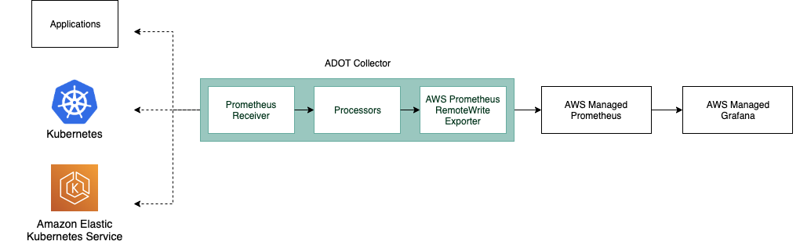
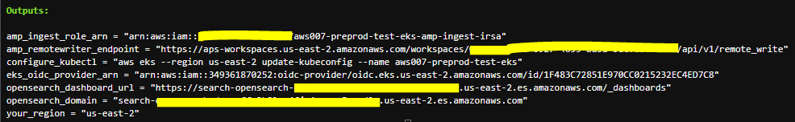
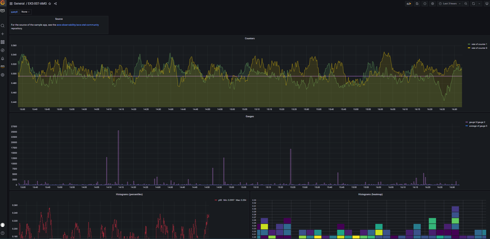
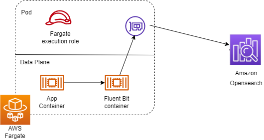
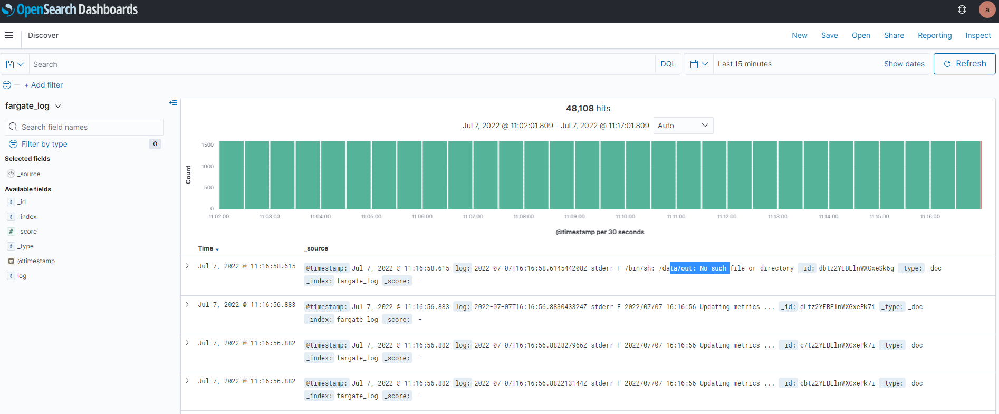

# eks-fargate-quickstart

Running Amazon EKS cluster under serverless mode is attracting more and more attention recently for cost reduction and administration work offload. A typical EKS cluster has two components: AWS managed control plane and customer managed data plane. For the data plane, the computing power could be provided by EC2 nodes or AWS Fargate. To minimize the administration work and only pay for what they need, more and more customers are looking to only use Fargate for their data plane.

This example shows how to provision a serverless EKS cluster (Fargate only data plane) with equipped monitoring and logging solutions.

Repo structure:

- current folder: provision a fargate only EKS cluster <br>
  a. one EKS cluster is created in a VPC with private and public subnets<br>
  b. EKS cluster is enabled with OIDC authentication and with private and public access<br>
  c. Fargate profiles are created with extra IAM roles for logging<br>
  d. Kubernetes add-ons: `vpc-cni`, `kube-proxy`, `coredns` and `ArgoCD`<br>
  e. Amazon Opensearch Service for logging<br>
  f. Amazon managed prmetheus for monitoring <br>

- adot-amp subfolder includes a yaml file to deploy adot agents in fargate and a yaml file for deploying an application for testing <br>
Monitoring your EKS cluster is important for ensuring that the applications running on it are performing properly. You can enable monitoring in EKS cluster by using tools like CloudWatch and Prometheus. However, none of them can be setup in Fargate only cluster easily. CloudWatch requires deploying DaemonSets agent (https://www.eksworkshop.com/intermediate/250_cloudwatch_container_insights/cwcinstall/)which is not supported by Fargate. Prometheus, by default, uses EBS as persistent storage which cannot be used in Fargate. User still can use Prometheus with EFS storage but there might be a performance concern with EFS.
    <br>
In this example, we use ADOT collector by following the diagram above. AMP and IAM role used by ADOT have been created in main,tf. ADOT collector can be deployed as deployment without persistent storage. Go to adot-collector-fargate.yaml in the folder adot-amp, replace <your eks cluster amp-ingest-irsa role>, <your amp remote write endpoint> and <your region> with your values (you can get those values in terraform apply output as below) and then apply adot-collector-fargate.yaml to your cluster.
   <br>
To validate the monitoring solution, you can deploy a test application by applying adot-amp/prometheus-sample-app.yaml. After that, you can visualize metric data using AMG which can be created and configured with SSO by following this link (https://aws.amazon.com/blogs/mt/amazon-managed-grafana-getting-started/). You can create a Grafana dashboard like below by importing adot-amp/prometheus-sample-app-dashboard.json.


- fluentbit-openseach-logging subfolder includes a yaml file to configure built-in fluentbit in fargate and a yaml file for deploying an application for testing <br>
In order to use Fluent Bit-based logging in EKS on Fargate, you apply a ConfigMap in fluentbit-openseach-logging/fargate-cm.yaml to your Amazon EKS clusters using Fluent Bit’s configuration as a data value, defining where container logs will be shipped to. Replace <your opensearch domain> and <your region> with your own values (get from terraform output) before applying. This logging ConfigMap has to be used in a fixed namespace called aws-observability has a cluster-wide effect, meaning that you can send application-level logs from any application in any namespace. As shown in the diagram below, Fluent Bit container sends logs to Amazon OpenSearch using Fargate execution role which has been attached with Amazon OpenSearch access policy earlier in terraform code.<br>
   

To validate the logging solution, you can deploy a test application by applying fluentbit-openseach-logging/test-app.yaml. Then go to your OpenSearch dashboard (get url from terraform output), login with the username and password defined in variables.tf (It is only for demo purpose. Please don’t put any sensitive data into code repo for production usage). As shown below, make sure that map the Fargate pod execution role as all_access and security_manager roles in OpenSearch. After that, you can query the logs in OpenSearch as shown below.
   
     

## supported regions for AMP
Europe (Stockholm)
Europe (London)
Europe (Ireland)
Asia Pacific (Tokyo)
Asia Pacific (Singapore)
Asia Pacific (Sydney)
Europe (Frankfurt)
US East (N. Virginia)
US East (Ohio)
US West (Oregon)


## Prerequisites:

Ensure that you have the following tools installed locally:

1. [aws cli](https://docs.aws.amazon.com/cli/latest/userguide/install-cliv2.html)
2. [kubectl](https://Kubernetes.io/docs/tasks/tools/)
3. [terraform](https://learn.hashicorp.com/tutorials/terraform/install-cli)

## Deploy

1. Go to directory <your repo directory>/observability/fargate-metric-logging

```sh
terraform init
terraform plan
terraform apply
```

Enter `yes` at command prompt to apply

- Validate
The following command will update the `kubeconfig` on your local machine and allow you to interact with your EKS Cluster using `kubectl` to validate the CoreDNS deployment for Fargate.

Run `update-kubeconfig` command:

```sh
aws eks --region <REGION> update-kubeconfig --name <CLSUTER_NAME>
```

Test by listing all the pods running currently. The CoreDNS pod should reach a status of `Running` after approximately 60 seconds:

```sh
kubectl get pods -A

# Output should look like below
NAMESPACE     NAME                      READY   STATUS    RESTARTS   AGE
kube-system   coredns-dcc8d4c97-2jvfb   1/1     Running   0          2m28s

2. Configure and test logging components
- Go to directory fluentbit-openseach-logging, replace <your opensearch domain> and <your region> in fargate-cm.yaml with your setup values. then run  kubectl apply -f  fargate-cm.yaml
- Deploy a test app by running kubectl apply -f test-app.yaml
- Go to your Amazon opensearch service opensearch-demo
    a. click OpenSearch Dashboards URL, in the login page, use default username/password defined in variables.tf
    b. Unde left side panel OpenSearch Plugins/Security, add your fargate execution role arn into all_access adn security_manager Role
    c. Then you can create index pattern and start using. the default index pattern is fargate_log

3. Configure and test your monitor components
- Go to directory adot-amp,replace <your eks cluster amp-ingest-irsa role>, <your amp remote write endpoint> and <your region> in adot-collector-fargate.yaml with your setup values. then run  kubectl apply -f adot-collector-fargate.yaml
- Deploy a test app by running kubectl apply -f prometheus-sample-app.yaml


## Destroy

To teardown and remove the resources created in this example:

```sh
terraform destroy -auto-approve
```
