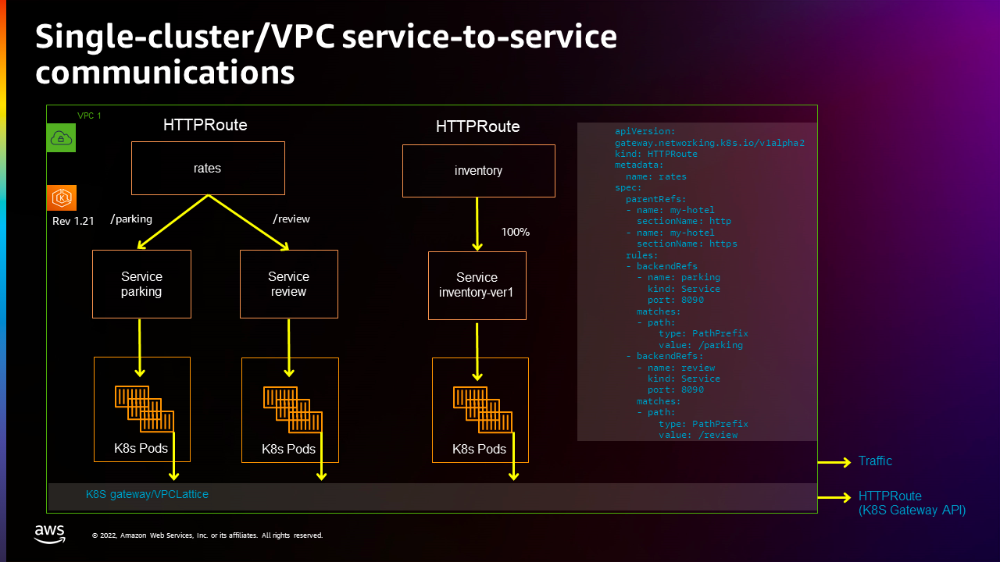
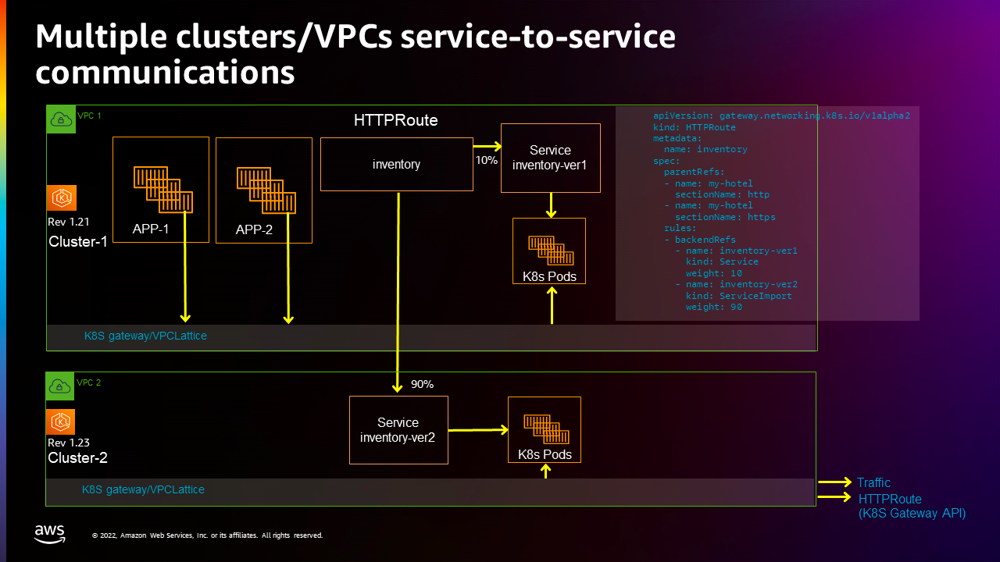

# Application Networking with Amazon VPC Lattice and Amazon EKS

This pattern showcases inter-cluster communication within an EKS cluster and across clusters and VPCs using VPC Lattice. It illustrates service discovery and highlights how VPC Lattice facilitates communication between services in EKS clusters with overlapping CIDRs, eliminating the need for networking constructs like private NAT Gateways and Transit Gateways.

- [Documentation](https://aws.amazon.com/vpc/lattice/)
- [Launch Blog](https://aws.amazon.com/blogs/containers/introducing-aws-gateway-api-controller-for-amazon-vpc-lattice-an-implementation-of-kubernetes-gateway-api/)

The solution architecture used to demonstrate single/cross-cluster connectivity with VPC Lattice is shown in the following diagram. The following are the relevant aspects of this architecture.

1. Two VPCs are setup in the same AWS Region, both using the same RFC 1918 address range 192.168.48.0/20
2. An EKS cluster is provisioned in each of the VPCs. 
3. The first part of this section provides an example of setting up of service-to-service communications on a single cluster. The second section extends that example by creating another inventory service on a second cluster on a different VPC, and spreading traffic to that service across the two clusters and VPCs



## Setup service-to-service communications

See [here](https://aws-ia.github.io/terraform-aws-eks-blueprints/getting-started/#prerequisites) for the prerequisites and steps to deploy this pattern.

1. set up the first cluster with its own VPC

```shell
   # setting up the cluster1
   cd cluster1
   terraform init
   terraform apply
```
2. Create Kubernetes Gateway `my-hotel`
```shell
aws eks update-kubeconfig --name  <cluster1-name>
kubectl apply -f my-hotel-gateway.yaml        # GatewayClass and Gateway
```
Verify that `my-hotel` Gateway is created with `PROGRAMMED` status equals to `True`:

```shell
kubectl get gateway

NAME       CLASS                ADDRESS   PROGRAMMED   AGE
my-hotel   amazon-vpc-lattice               True      7d12h
```
3. Create the Kubernetes `HTTPRoute` rates that can has path matches routing to the `parking` service and `review` service (this could take about a few minutes)

```shell
kubectl apply -f parking.yaml
kubectl apply -f review.yaml
kubectl apply -f rate-route-path.yaml
```
4. Create another Kubernetes `HTTPRoute` inventory (this could take about a few minutes):

```shell
kubectl apply -f inventory-ver1.yaml
kubectl apply -f inventory-route.yaml
```
Find out HTTPRoute's DNS name from HTTPRoute status:

```shell
kubectl get httproute

NAME        HOSTNAMES   AGE
inventory               51s
rates                   6m11s
```

Check VPC Lattice generated DNS address for HTTPRoute `inventory` and `rates`:

```shell
kubectl get httproute inventory -o yaml

apiVersion: gateway.networking.k8s.io/v1beta1
kind: HTTPRoute
metadata:
  annotations:
    application-networking.k8s.aws/lattice-assigned-domain-name: inventory-default-02fb06f1acdeb5b55.7d67968.vpc-lattice-svcs.us-west-2.on.aws
...
```
```shell
kubectl get httproute rates -o yaml

apiVersion: v1
items:
- apiVersion: gateway.networking.k8s.io/v1beta1
  kind: HTTPRoute
  metadata:
    annotations:
      application-networking.k8s.aws/lattice-assigned-domain-name: rates-default-0d38139624f20d213.7d67968.vpc-lattice-svcs.us-west-2.on.aws
...
```

If the previous step returns the expected response, store VPC Lattice assigned DNS names to variables.

```shell
ratesFQDN=$(kubectl get httproute rates -o json | jq -r '.metadata.annotations."application-networking.k8s.aws/lattice-assigned-domain-name"')
inventoryFQDN=$(kubectl get httproute inventory -o json | jq -r '.metadata.annotations."application-networking.k8s.aws/lattice-assigned-domain-name"')
```

Confirm that the URLs are stored correctly:

```shell
echo $ratesFQDN $inventoryFQDN
rates-default-034e0056410499722.7d67968.vpc-lattice-svcs.us-west-2.on.aws inventory-default-0c54a5e5a426f92c2.7d67968.vpc-lattice-svcs.us-west-2.on.aws

```

### Verify service-to-service communications

1. Check connectivity from the `inventory-ver1` service to `parking` and `review` services:

```shell
kubectl exec deploy/inventory-ver1 -- curl $ratesFQDN/parking $ratesFQDN/review

Requsting to Pod(parking-8548d7f98d-57whb): parking handler pod
Requsting to Pod(review-6df847686d-dhzwc): review handler pod
```
2. Check connectivity from the `parking` service to the `inventory-ver1` service:
```shell
kubectl exec deploy/parking -- curl $inventoryFQDN
Requsting to Pod(inventory-ver1-99d48958c-whr2q): Inventory-ver1 handler pod
```

Now you could confirm the service-to-service communications within one cluster is working as expected.

## Set up multi-cluster/multi-VPC service-to-service communications



1. set up the first cluster with its own VPC

```shell
   # setting up the cluster1
   cd ../cluster2
   terraform init
   terraform apply
```

2. Create a Kubernetes inventory-ver2 service in the second cluster:

```shell
aws eks update-kubeconfig --name  <cluster2-name>
kubectl apply -f inventory-ver2.yaml
```
3. Export this Kubernetes inventory-ver2 from the second cluster, so that it can be referenced by HTTPRoute in the first cluster:

```shell
kubectl apply -f inventory-ver2-export.yaml
```

## Switch back to the first cluster

1. Switch context back to the first cluster
```shell
cd ../cluster1/
kubectl config use-context <cluster1-context>
```

2. Create Kubernetes ServiceImport `inventory-ver2` in the first cluster:

```shell
kubectl apply -f inventory-ver2-import.yaml
```
3. Update the HTTPRoute inventory rules to route 10% traffic to the first cluster and 90% traffic to the second cluster:
```shell
kubectl apply -f inventory-route-bluegreen.yaml
```
4. Check the service-to-service connectivity from `parking`(in cluster1) to `inventory-ver1`(in cluster1) and `inventory-ver2`(in cluster2):
```shell
kubectl exec deploy/parking -- sh -c 'for ((i=1; i<=30; i++)); do curl "$0"; done' "$inventoryFQDN"

Requsting to Pod(inventory-ver2-6dc74b45d8-rlnlt): Inventory-ver2 handler pod <----> in 2nd cluster
Requsting to Pod(inventory-ver2-6dc74b45d8-rlnlt): Inventory-ver2 handler pod
Requsting to Pod(inventory-ver2-6dc74b45d8-rlnlt): Inventory-ver2 handler pod
Requsting to Pod(inventory-ver2-6dc74b45d8-rlnlt): Inventory-ver2 handler pod
Requsting to Pod(inventory-ver2-6dc74b45d8-95rsr): Inventory-ver1 handler pod <----> in 1st cluster
Requsting to Pod(inventory-ver2-6dc74b45d8-rlnlt): Inventory-ver2 handler pod
Requsting to Pod(inventory-ver2-6dc74b45d8-95rsr): Inventory-ver2 handler pod
Requsting to Pod(inventory-ver2-6dc74b45d8-95rsr): Inventory-ver2 handler pod
Requsting to Pod(inventory-ver1-74fc59977-wg8br): Inventory-ver1 handler pod....

```
You can see that the traffic is distributed between inventory-ver1 and inventory-ver2 as expected.

## Destroy

To teardown and remove the resources created in this example:

```shell
cd cluster1
terraform apply -destroy -autoapprove
cd ../cluster2
terraform apply -destroy -autoapprove
```


