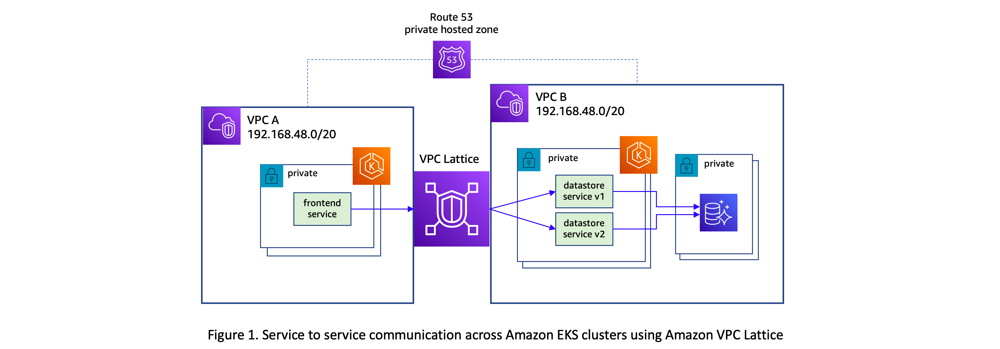

# Application Networking with Amazon VPC Lattice and Amazon EKS

This pattern demonstrates where a service in one EKS cluster communicates with a service in another cluster and VPC, using VPC Lattice. Besides it also shows how service discovery works, with support for using custom domain names for services. It also demonstrates how VPC Lattice enables services in EKS clusters with overlapping CIDRs to communicate with each other without the need for any networking constructs like private NAT Gateways and Transit Gateways.

- [Documentation](https://aws.amazon.com/vpc/lattice/)
- [Launch Blog](https://aws.amazon.com/blogs/containers/amazon-vpc-cni-now-supports-kubernetes-network-policies/)

## Scenario

The solution architecture used to demonstrate cross-cluster connectivity with VPC Lattice is shown in the following diagram. The following are the relevant aspects of this architecture.

1. Two VPCs are setup in the same AWS Region, both using the same RFC 1918 address range 192.168.48.0/20
2. An EKS cluster is provisioned in each of the VPC. 
3. An HTTP web service is deployed to the EKS cluster in Cluster1-vpc , exposing a set of REST API endpoints. Another REST API service is deployed to the EKS cluster in Cluster2-vpc and it communicates with an Aurora PostgreSQL database in the same VPC.
AWS Gateway API controller is used in both clusters to manage the Kubernetes Gateway API resources such as Gateway and HTTPRoute. These custom resources orchestrate AWS VPC Lattice resources such as Service Network, Service, and Target Groups that enable communication between the Kubernetes services deployed to the clusters. Please refer to this post for a detailed discussion on how the AWS Gateway API controller extends custom resources defined by Gateway API, allowing you to create VPC Lattice resources using Kubernetes APIs.




## Deploy

See [here](https://aws-ia.github.io/terraform-aws-eks-blueprints/getting-started/#prerequisites) for the prerequisites and steps to deploy this pattern.

1. set up the first cluster with its own VPC and the second 

```shell
   # setting up the cluster1
   cd cluster1
   terraform init
   terraform apply
   
   cd ../cluster2
   terraform init
   terraform apply
```

2. Initialize the aurora postgress database for cluster2 vpc refer [here](./cluster2/postgres-setup/README.md)
3. Initialize Kubernetes secrets for cluster2

```shell
cd cluster2
chmod +x secrets.sh && ./secrets.sh
```
4. Deploy the kubernetes artefacts for cluster2 

```shell
export CLUSTER_2=cluster2
export AWS_DEFAULT_REGION=$(aws configure get region)
export AWS_ACCOUNT_NUMBER=$(aws sts get-caller-identity --query "Account" --output text)

aws eks update-kubeconfig --name $CLUSTER_2 --region $AWS_DEFAULT_REGION

export CTX_CLUSTER_2=arn:aws:eks:$AWS_DEFAULT_REGION:${AWS_ACCOUNT_NUMBER}:cluster/$CLUSTER_2


kubectl apply --context="${CTX_CLUSTER_2}" -f ./$CLUSTER_2/gateway-lattice.yaml          # GatewayClass and Gateway
kubectl apply --context="${CTX_CLUSTER_2}" -f ./$CLUSTER_2/route-datastore-canary.yaml   # HTTPRoute and ClusterIP Services
kubectl apply --context="${CTX_CLUSTER_2}" -f ./$CLUSTER_2/datastore.yaml                # Deployment
```

5. Deploy the gateway lattice and the frontend service on cluster1

```shell
export CLUSTER_1=cluster1
export AWS_DEFAULT_REGION=$(aws configure get region)
export AWS_ACCOUNT_NUMBER=$(aws sts get-caller-identity --query "Account" --output text)

aws eks update-kubeconfig --name $CLUSTER_1 --region $AWS_DEFAULT_REGION

export CTX_CLUSTER_1=arn:aws:eks:$AWS_DEFAULT_REGION:${AWS_ACCOUNT_NUMBER}:cluster/$CLUSTER_1


kubectl apply --context="${CTX_CLUSTER_1}" -f ./$CLUSTER_1/gateway-lattice.yaml                          # GatewayClass and Gateway
kubectl apply --context="${CTX_CLUSTER_1}" -f ./$CLUSTER_1/frontend.yaml 
```


## Destroy

```shell
chmod +x ./destroy.sh && ./destroy.sh
```
