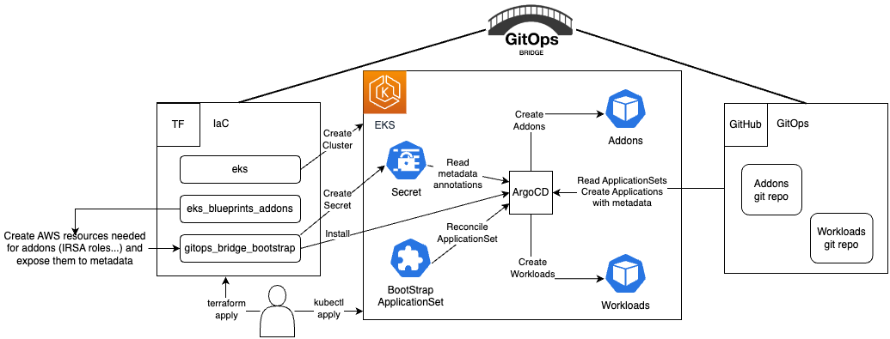

# ArgoCD on Amazon EKS

This tutorial guides you through deploying an Amazon EKS cluster with addons configured via ArgoCD, employing the [GitOps Bridge Pattern](https://github.com/gitops-bridge-dev).




The [GitOps Bridge Pattern](https://github.com/gitops-bridge-dev) enables Kubernetes administrators to utilize Infrastructure as Code (IaC) and GitOps tools for deploying Kubernetes Addons and Workloads. Addons often depend on Cloud resources that are external to the cluster. The configuration metadata for these external resources is required by the Addons' Helm charts. While IaC is used to create these cloud resources, it is not used to install the Helm charts. Instead, the IaC tool stores this metadata either within GitOps resources in the cluster or in a Git repository. The GitOps tool then extracts these metadata values and passes them to the Helm chart during the Addon installation process. This mechanism forms the bridge between IaC and GitOps, hence the term "GitOps Bridge."

Aditonal examples available on the [GitOps Bridge Pattern](https://github.com/gitops-bridge-dev):
- [argocd-ingress](https://github.com/gitops-bridge-dev/gitops-bridge/tree/main/argocd/iac/terraform/examples/eks/argocd-ingress)
- [aws-secrets-manager](https://github.com/gitops-bridge-dev/gitops-bridge/tree/main/argocd/iac/terraform/examples/eks/aws-secrets-manager)
- [crossplane](https://github.com/gitops-bridge-dev/gitops-bridge/tree/main/argocd/iac/terraform/examples/eks/crossplane)
- [external-secrets](https://github.com/gitops-bridge-dev/gitops-bridge/tree/main/argocd/iac/terraform/examples/eks/external-secrets)
- [multi-cluster/distributed](https://github.com/gitops-bridge-dev/gitops-bridge/tree/main/argocd/iac/terraform/examples/eks/multi-cluster/distributed)
- [multi-cluster/hub-spoke](https://github.com/gitops-bridge-dev/gitops-bridge/tree/main/argocd/iac/terraform/examples/eks/multi-cluster/hub-spoke)
- [multi-cluster/hub-spoke-shared](https://github.com/gitops-bridge-dev/gitops-bridge/tree/main/argocd/iac/terraform/examples/eks/multi-cluster/hub-spoke-shared)
- [private-git](https://github.com/gitops-bridge-dev/gitops-bridge/tree/main/argocd/iac/terraform/examples/eks/private-git)


## Prerequisites
Before you begin, make sure you have the following command line tools installed:
- git
- terraform
- kubectl
- argocd

## Fork the Git Repositories

### Fork the Addon GitOps Repo
1. Fork the git repository for addons [here](https://github.com/aws-samples/eks-blueprints-add-ons).
2. Update the following environment variables to point to your fork by changing the default values:
```shell
export TF_VAR_gitops_addons_org=https://github.com/aws-samples
export TF_VAR_gitops_addons_repo=eks-blueprints-add-ons
export TF_VAR_gitops_addons_revision=main
```

### Fork the Workloads GitOps Repo
1. Fork the git repository for this pattern [here](https://github.com/aws-ia/terraform-aws-eks-blueprints)
2. Update the following environment variables to point to your fork by changing the default values:
```shell
export TF_VAR_gitops_workload_org=https://github.com/aws-ia
export TF_VAR_gitops_workload_repo=terraform-aws-eks-blueprints
export TF_VAR_gitops_workload_revision=main
```

## Deploy the EKS Cluster
Initialize Terraform and deploy the EKS cluster:
```shell
terraform init
terraform apply -target="module.vpc" -auto-approve
terraform apply -target="module.eks" -auto-approve
terraform apply -target="module.eks_blueprints_addons" -auto-approve
terraform apply -auto-approve
```
Retrieve `kubectl` config, then execute the output command:
```shell
terraform output -raw configure_kubectl
```

Terraform will add GitOps Bridge Metadata to the ArgoCD secret.
The annotations contain metadata for the addons' Helm charts and ArgoCD ApplicationSets.
```shell
kubectl get secret -n argocd -l argocd.argoproj.io/secret-type=cluster -o json | jq '.items[0].metadata.annotations'
```
The output looks like the following:
```json
{
  "addons_repo_basepath": "argocd/",
  "addons_repo_path": "bootstrap/control-plane/addons",
  "addons_repo_revision": "main",
  "addons_repo_url": "https://github.com/aws-samples/eks-blueprints-add-ons",
  "aws_account_id": "0123456789",
  "aws_cluster_name": "getting-started-gitops",
  "aws_load_balancer_controller_iam_role_arn": "arn:aws:iam::0123456789:role/alb-controller",
  "aws_load_balancer_controller_namespace": "kube-system",
  "aws_load_balancer_controller_service_account": "aws-load-balancer-controller-sa",
  "aws_region": "us-west-2",
  "aws_vpc_id": "vpc-001d3f00151bbb731",
  "cluster_name": "in-cluster",
  "environment": "dev",
  "workload_repo_basepath": "patterns/gitops/",
  "workload_repo_path": "getting-started-argocd/k8s",
  "workload_repo_revision": "main",
  "workload_repo_url": "https://github.com/csantanapr/terraform-aws-eks-blueprints"
}
```
The labels offer a straightforward way to enable or disable an addon in ArgoCD for the cluster.
```shell
kubectl get secret -n argocd -l argocd.argoproj.io/secret-type=cluster -o json | jq '.items[0].metadata.labels'
```
The output looks like the following:
```json
{
  "aws_cluster_name": "getting-started-gitops",
  "enable_argocd": "true",
  "enable_aws_load_balancer_controller": "true",
  "enable_metrics_server": "true",
  "kubernetes_version": "1.28",
}
```

## Deploy the Addons
Bootstrap the addons using ArgoCD:
```shell
kubectl apply -f bootstrap/addons.yaml
```

### Monitor GitOps Progress for Addons
Wait until all the ArgoCD applications' `HEALTH STATUS` is `Healthy`. Use Crl+C to exit the `watch` command
```shell
watch kubectl get applications -n argocd
```

### Verify the Addons
Verify that the addons are ready:
```shell
kubectl get deployment -n kube-system \
  aws-load-balancer-controller \
  metrics-server
```

## Access ArgoCD
Access ArgoCD's UI, run the command from the output:
```shell
terraform output -raw access_argocd
```

## Deploy the Workloads
Deploy a sample application located in [k8s/game-2048.yaml](k8s/game-2048.yaml) using ArgoCD:
```shell
kubectl apply -f bootstrap/workloads.yaml
```

### Monitor GitOps Progress for Workloads
Watch until the Workloads ArgoCD Application is `Healthy`
```shell
watch kubectl get -n argocd applications workloads
```
Wait until the ArgoCD Applications `HEALTH STATUS` is `Healthy`. Crl+C to exit the `watch` command

### Verify the Application
Verify that the application configuration is present and the pod is running:
```shell
kubectl get -n game-2048 deployments,service,ep,ingress
```
Wait until the Ingress/game-2048 `MESSAGE` column value is `Successfully reconciled`. Crl+C to exit the `watch` command
```shell
kubectl events -n game-2048 --for ingress/game-2048 --watch
```

### Access the Application using AWS Load Balancer
Verify the application endpoint health using `curl`:
```shell
curl -I $(kubectl get -n game-2048 ingress game-2048 -o jsonpath='{.status.loadBalancer.ingress[0].hostname}')
```
The first line of the output should be `HTTP/1.1 200 OK`.

Retrieve the ingress URL for the application:
```shell
echo "Application URL: http://$(kubectl get -n game-2048 ingress game-2048 -o jsonpath='{.status.loadBalancer.ingress[0].hostname}')"
```


### Container Metrics
Check the application's CPU and memory metrics:
```shell
kubectl top pods -n game-2048
```

## Destroy the EKS Cluster
To tear down all the resources and the EKS cluster, run the following command:
```shell
./destroy.sh
```
