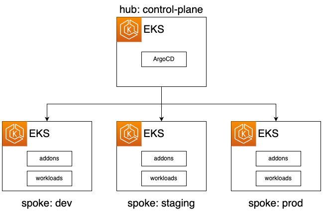

# Multi-Cluster centralized hub-spoke topology

This tutorial guides you through deploying an Amazon EKS cluster with addons configured via ArgoCD in a Multi-Cluster Hub-Spoke topoloy, employing the [GitOps Bridge Pattern](https://github.com/gitops-bridge-dev).




This example deploys ArgoCD on the Hub cluster (ie. management/control-plane cluster).
The spoke clusters are registered as remote clusters in the Hub Cluster's ArgoCD
The ArgoCD on the Hub Cluster deploy addons and workloads to the spoke clusters

Each spoke cluster gets deployed an app of apps ArgoCD Application with the name `workloads-${env}`

## Prerequisites
Before you begin, make sure you have the following command line tools installed:
- git
- terraform
- kubectl
- argocd

## Fork the Git Repositories

### Fork the Addon GitOps Repo
1. Fork the git repository for addons [here](https://github.com/gitops-bridge-dev/gitops-bridge-argocd-control-plane-template).
2. Update the following environment variables to point to your fork by changing the default values:
```shell
export TF_VAR_gitops_addons_org=https://github.com/gitops-bridge-dev
export TF_VAR_gitops_addons_repo=gitops-bridge-argocd-control-plane-template
```

## Deploy the Hub EKS Cluster
Change Director to `hub`
```shell
cd hub
```
Initialize Terraform and deploy the EKS cluster:
```shell
terraform init
terraform apply -auto-approve
```
Retrieve `kubectl` config, then execute the output command:
```shell
terraform output -raw configure_kubectl
```

### Monitor GitOps Progress for Addons
Wait until **all** the ArgoCD applications' `HEALTH STATUS` is `Healthy`. Use Crl+C to exit the `watch` command
```shell
watch kubectl get applications -n argocd
```

## Access ArgoCD on Hub Cluster
Access ArgoCD's UI, run the command from the output:
```shell
terraform output -raw access_argocd
```

## Verify that ArgoCD Service Accouts has the annotation for IRSA
```shell
kubectl get sa -n argocd argocd-application-controller -o json | jq '.metadata.annotations."eks.amazonaws.com/role-arn"'
kubectl get sa -n argocd argocd-server  -o json | jq '.metadata.annotations."eks.amazonaws.com/role-arn"'
```
The output should match the `arn` for the IAM Role that will assume the IAM Role in spoke/remote clusters
```text
"arn:aws:iam::0123456789:role/hub-spoke-control-plane-argocd-hub"
```

## Deploy the Spoke EKS Cluster
Initialize Terraform and deploy the EKS clusters:
```shell
cd ../spokes
./deploy.sh dev
./deploy.sh staging
./deploy.sh prod
```
Each environment uses a Terraform workspace

To access Terraform output run the following commands for the particular environment
```shell
terraform workspace select dev
terraform output
```
```shell
terraform workspace select staging
terraform output
```
```shell
terraform workspace select prod
terraform output
```

Retrieve `kubectl` config, then execute the output command:
```shell
terraform output -raw configure_kubectl
```

### Verify ArgoCD Cluster Secret for Spoke has the correct IAM Role to be assume by Hub Cluster
```shell
kubectl get secret -n argocd hub-spoke-dev --template='{{index .data.config | base64decode}}'
```
Do the same for the other cluster replaced `dev` in `hub-spoke-dev`
The output have a section `awsAuthConfig` with the `clusterName` and the `roleARN` that has write access to the spoke cluster
```json
{
  "tlsClientConfig": {
    "insecure": false,
    "caData" : "LS0tL...."
  },
  "awsAuthConfig" : {
    "clusterName": "hub-spoke-dev",
    "roleARN": "arn:aws:iam::0123456789:role/hub-spoke-dev-argocd-spoke"
  }
}
```


### Verify the Addons on Spoke Clusters
Verify that the addons are ready:
```shell
kubectl get deployment -n kube-system \
  metrics-server
```


### Monitor GitOps Progress for Workloads from Hub Cluster (run on Hub Cluster context)
Watch until **all* the Workloads ArgoCD Applications are `Healthy`
```shell
watch kubectl get -n argocd applications
```
Wait until the ArgoCD Applications `HEALTH STATUS` is `Healthy`. Crl+C to exit the `watch` command


### Verify the Application
Verify that the application configuration is present and the pod is running:
```shell
kubectl get all -n workload
```

### Container Metrics
Check the application's CPU and memory metrics:
```shell
kubectl top pods -n workload
```

## Destroy the Spoke EKS Clusters
To tear down all the resources and the EKS cluster, run the following command:
```shell
./destroy.sh dev
./destroy.sh staging
./destroy.sh prod
```

## Destroy the Hub EKS Clusters
To tear down all the resources and the EKS cluster, run the following command:
Destroy Hub Clusters
```shell
cd ../hub
./destroy.sh
```
