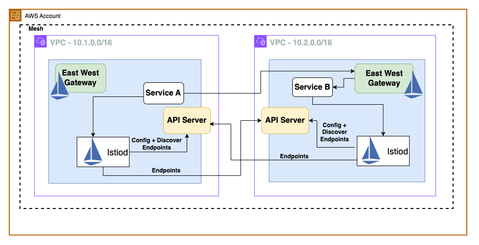

# Istio multi-network, multi-primary on EKS

## Business Use Cases for Istio Multi-Cluster

**Fault Tolerance and High Availability:** For applications that require global reach or disaster recovery capabilities, Istio Multi-Cluster allows you to distribute your services across clusters in multiple geographic regions or availability zones enhancing resilience to failures and outages.. This improves availability, fault tolerance, and reduces latency by serving users from the nearest cluster.

**Isolation and Multitenancy:** In large organizations with multiple teams or business units, Istio Multi-Cluster allows you to isolate workloads into separate clusters while still maintaining a unified service mesh. This promotes multitenancy, security, and resource isolation between different applications or environments. It also strengthens security posture by implementing strict access controls and network segmentation, preventing unauthorized inter-service communications.

**Compliance and Regulatory Requirements:** In some industries, there may be requirements to keep certain data or workloads in specific geographic regions or environments. Istio Multi-Cluster enables you to deploy and manage applications across these isolated environments while still maintaining a unified service mesh. Istio's multi-cluster architecture ensures data segregation and compliance with regulations like GDPR and PCI DSS through Istio's multi-cluster architecture.

**Scalability, Performance and Load Balancing:** Istio Multi-Cluster achieves horizontal scaling and performance optimization by adding clusters in different regions, catering to traffic surges and reducing latency. Istio Multi-Cluster also provides load balancing across clusters, enabling you to distribute the load and avoid overloading a single cluster.

**Canary Deployments and A/B Testing:** When rolling out new versions of applications, you can use Istio Multi-Cluster to deploy the new version to a subset of clusters, allowing you to test and validate the changes before rolling them out to all clusters. This enables canary deployments and A/B testing across multiple clusters.

**Migration and Modernization:** If you're migrating applications from legacy systems to Kubernetes or modernizing your applications, Istio Multi-Cluster can help you manage the transition by allowing you to run the old and new versions of your applications in separate clusters while still maintaining connectivity and consistent policies.



## Prerequisites

Ensure that you have installed the following tools locally:

1. [awscli](https://docs.aws.amazon.com/cli/latest/userguide/install-cliv2.html)
2. [kubectl](https://kubernetes.io/docs/tasks/tools/)
3. [terraform](https://learn.hashicorp.com/tutorials/terraform/install-cli)
4. [istioctl](https://istio.io/latest/docs/ops/diagnostic-tools/istioctl/)

## Deploy 

To deploy the terraform repo, run the commands shown below:
```sh 
./scripts/deploy.sh 
```

After running the command successfully, set the kubeconfig for both EKS clusters:
```sh 
source scripts/set-cluster-contexts.sh
```

> **Note:** If using different cluster names other than the default `eks-1` and 
`eks-2`, use the following command:

```sh 
source scripts/set-cluster-contexts.sh eks_cluster_name_1 eks_cluster_name_2
```


## Testing

### Readiness of the Istio Gateway loadbalancers

Before you could do any testing, you need to ensure that:
* The loadbalancer for `istio-eastwestgateway` service is ready for the traffic 
* The loadblanncer target groups have their targets ready. 

Use the following script to test the readiness of the LBs:
```sh 
./scripts/check-lb-readiness.sh
```
> **Note:** If using different cluster names other than the default `eks-1` and 
`eks-2` use the following command:
```sh 
./scripts/check-lb-readiness.sh eks_cluster_name_1 eks_cluster_name_2
```


You should see an output similar to below before proceeding any further:
```
Updated context arn:aws:eks:us-west-2:XXXXXXXXXXXX:cluster/eks-1 in /Users/maverick/.kube/config
Updated context arn:aws:eks:us-west-2:XXXXXXXXXXXX:cluster/eks-2 in /Users/maverick/.kube/config

Readiness check for arn:aws:eks:us-west-2:XXXXXXXXXXXX:cluster/eks-1:
{
  "Target": {
    "Id": "10.1.21.197",
    "Port": 15443,
    "AvailabilityZone": "us-west-2b"
  },
  "HealthCheckPort": "15443",
  "TargetHealth": {
    "State": "healthy"
  }
}

Readiness check for arn:aws:eks:us-west-2:XXXXXXXXXXXX:cluster/eks-2:
{
  "Target": {
    "Id": "10.2.23.10",
    "Port": 15443,
    "AvailabilityZone": "us-west-2b"
  },
  "HealthCheckPort": "15443",
  "TargetHealth": {
    "State": "healthy"
  }
}
```

### Cross-Cluster Sync

Run the following commands to ensure that the public Load Balancer IP addresses 
are displayed in the output as shown. 

```sh 
./scripts/check-cross-cluster-sync.sh
```

> **Note:** If using different cluster names other than the default `eks-1` and 
`eks-2` use the following command:
```sh 
./scripts/check-cross-cluster-sync.sh eks_cluster_name_1 eks_cluster_name_2
```


The output should be similar to:
```
Updated context arn:aws:eks:us-west-2:XXXXXXXXXXXX:cluster/eks-1 in /Users/maverick/.kube/config
Updated context arn:aws:eks:us-west-2:XXXXXXXXXXXX:cluster/eks-2 in /Users/maverick/.kube/config

Cross cluster sync check for arn:aws:eks:us-west-2:XXXXXXXXXXXX:cluster/eks-1:
10.1.24.17:5000                                         HEALTHY     OK                outbound|5000||helloworld.sample.svc.cluster.local
44.227.39.238:15443                                     HEALTHY     OK                outbound|5000||helloworld.sample.svc.cluster.local
44.229.207.145:15443                                    HEALTHY     OK                outbound|5000||helloworld.sample.svc.cluster.local
52.33.147.49:15443                                      HEALTHY     OK                outbound|5000||helloworld.sample.svc.cluster.local

Cross cluster sync check for arn:aws:eks:us-west-2:XXXXXXXXXXXX:cluster/eks-2:
10.2.30.251:5000                                        HEALTHY     OK                outbound|5000||helloworld.sample.svc.cluster.local
34.213.174.24:15443                                     HEALTHY     OK                outbound|5000||helloworld.sample.svc.cluster.local
54.148.164.231:15443                                    HEALTHY     OK                outbound|5000||helloworld.sample.svc.cluster.local
54.148.184.188:15443                                    HEALTHY     OK                outbound|5000||helloworld.sample.svc.cluster.local
```

If you see public IP addresses in the output for both the clusters proceed 
further to test multi-cluster communication.

### Cross-cluster Load-Balancing 

Run the following command to check cross-cluster loadbalancing from the first 
cluster.

```
for i in {1..10}
do 
kubectl exec --context="${CTX_CLUSTER1}" -n sample -c sleep \
    "$(kubectl get pod --context="${CTX_CLUSTER1}" -n sample -l \
    app=sleep -o jsonpath='{.items[0].metadata.name}')" \
    -- curl -sS helloworld.sample:5000/hello
done
```
Also test similar command to check cross-cluster loadbalancing from the second 
cluster.

```
for i in {1..10}
do 
kubectl exec --context="${CTX_CLUSTER2}" -n sample -c sleep \
    "$(kubectl get pod --context="${CTX_CLUSTER2}" -n sample -l \
    app=sleep -o jsonpath='{.items[0].metadata.name}')" \
    -- curl -sS helloworld.sample:5000/hello
done
```

In either case the output should be similar to:

```
Hello version: v1, instance: helloworld-v1-867747c89-7vzwl
Hello version: v2, instance: helloworld-v2-7f46498c69-5g9rk
Hello version: v1, instance: helloworld-v1-867747c89-7vzwl
Hello version: v1, instance: helloworld-v1-867747c89-7vzwl
Hello version: v2, instance: helloworld-v2-7f46498c69-5g9rk
Hello version: v1, instance: helloworld-v1-867747c89-7vzwl
Hello version: v2, instance: helloworld-v2-7f46498c69-5g9rk
Hello version: v1, instance: helloworld-v1-867747c89-7vzwl
Hello version: v1, instance: helloworld-v1-867747c89-7vzwl
Hello version: v2, instance: helloworld-v2-7f46498c69-5g9rk
```

## Destroy 
```sh 
./scripts/destroy.sh 
```

## Troubleshooting

There are many things that can go wrong when deploying a complex solutions such 
as this, Istio multi-primary on different networks.

### Ordering in Terraform deployment

The ordering is important when deploying the resources with Terraform and here 
it is:
1. Deploy the VPCs and EKS clusters 
2. Deploy the `cacerts` secret in the `istio-system` namespace in both clusters
4. Deploy the control plane `istiod` in both clusters
5. Deploy the rest of the resources, including Helm Chart `multicluster-gateway-n-apps`
in both clusters. 

The `multicluster-gateway-n-apps` Helm chart includes the following key resources:
1. `Deployment`, `Service Account` and `Service` definitions for `sleep` app
2. `Deployment` and `Service` definitions for `helloworld` app
3. Static `Gateway` definition of `cross-network-gateway` in `istio-ingress` namespace 
4. Templated `Secret` definition of `istio-remote-secret-*`


## Documentation Links 

1. [Install Multi-Primary on different networks](https://istio.io/latest/docs/setup/install/multicluster/multi-primary_multi-network/)
2. [Verifying cross-cluster traffic](https://istio.io/latest/docs/setup/install/multicluster/verify/#verifying-cross-cluster-traffic)
3. [Multicluster Troubleshooting](https://istio.io/latest/docs/ops/diagnostic-tools/multicluster/)
