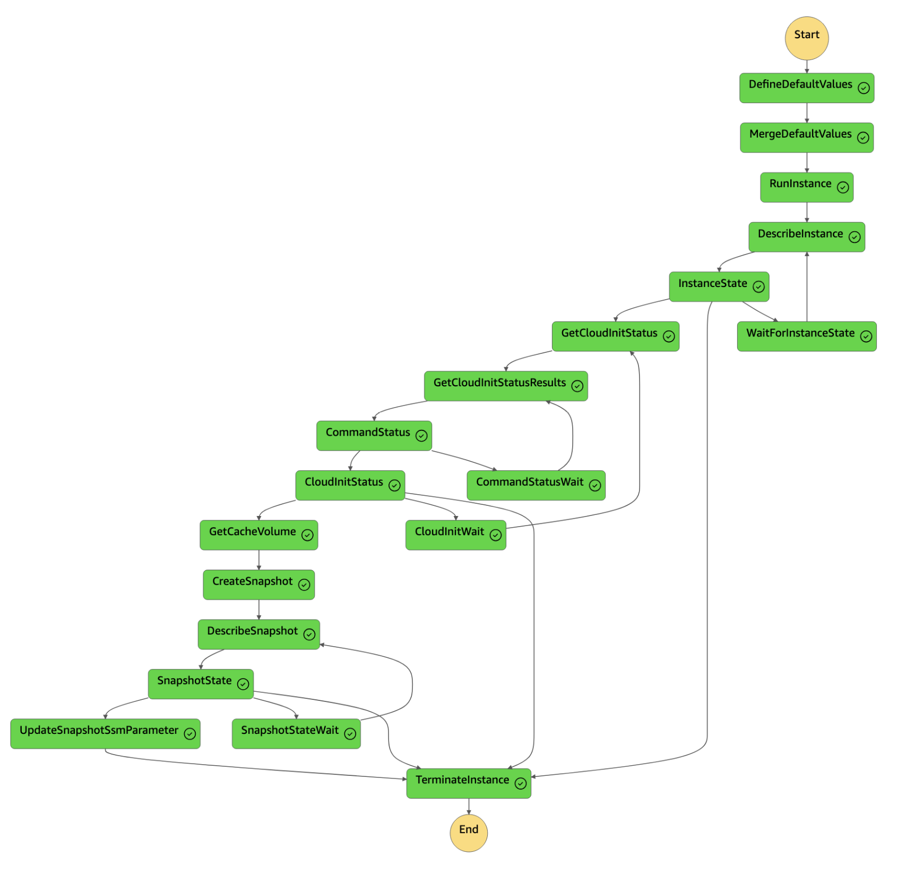

# EKS Cluster w/ Cached ML Images

This pattern demonstrates how to cache images on an EBS volume snapshot that will be used by nodes in an EKS cluster. The solution is comprised of primarily of the following components:

1. An AWS Step Function implementation has been provided that demonstrates an example process for creating EBS volume snapshots that are pre-populated with the select container images. As part of this process, EBS Fast Snapshot Restore is enabled by default for the snapshots created to avoid the [EBS volume  initialization time penalty](https://aws.amazon.com/blogs/storage/addressing-i-o-latency-when-restoring-amazon-ebs-volumes-from-ebs-snapshots/). The Step Function state machine diagram is captured below for reference.
2. The node group demonstrates how to mount the generated EBS volume snapshot at the `/var/lib/containerd` location in order for containerd to utilize the pre-populated images. The snapshot ID is referenced via an SSM parameter data source which was populated by the Step Function cache builder; any new images created by the cache builder will automatically update the SSM parameter used by the node group.

The main benefit of caching, or pre-pulling, container images onto an EBS volume snapshot is faster time to start pods/containers on new nodes, especially for larger (multi-gigabyte) images that are common with machine-learning workloads. This process avoids the time and resources it takes to pull and un-pack container images from remote registries. Instead, those images are already present in the location that containerd expects, allowing for faster pod startup times.

### Cache Builder State Machine

<p align="center">
  
</p>

## Results

The following results use the PyTorch [nvcr.io/nvidia/pytorch:24.08-py3](https://catalog.ngc.nvidia.com/orgs/nvidia/containers/pytorch/tags) image which is 9.5 GB compressed and 20.4 GB decompressed on disk.

Pod start up time duration is captured via pod events using [ktime](https://github.com/clowdhaus/ktime).

### Cached

With the PyTorch image already present on the EBS volume, the pod starts up in less than 5 seconds:

<p align="center">
  
</p>

### Uncached

When the PyTorch image is not present on the EBS volume, it takes roughly 6 minutes (334 seconds in the capture below) for the image to be pulled, unpacked, and the pod to start.

<p align="center">
  
</p>

## Code

### Cache Builder

```terraform hl_lines="7-11 13-14"

```

### Cluster

```terraform hl_lines="5-9 52-64 66-78"

```

## Deploy

See [here](https://aws-ia.github.io/terraform-aws-eks-blueprints/getting-started/#prerequisites) for the prerequisites and steps to deploy this pattern.

1. First, deploy the Step Function state machine that will create the EBS volume snapshots with the cached images.

    ```sh
    terraform init
    terraform apply -target=module.ebs_snapshot_builder -target=module.vpc --auto-approve
    ```

2. Once the cache builder resources have been provisioned, execute the state machine by either navigating to the state machine within the AWS console and clicking `Start execution` (with the defaults or by passing in values to override the default values), or by using the provided output from the Terraform output value `start_execution_command` to start the state machine using the awscli. For example, the output looks similar to the following:

    ```hcl
    start_execution_command = <<EOT
    aws stepfunctions start-execution \
      --region us-west-2 \
      --state-machine-arn arn:aws:states:us-west-2:111111111111:stateMachine:cache-builder \
      --input "{\"SnapshotDescription\":\"ML container image cache\",\"SnapshotName\":\"ml-container-cache\"}"

    EOT
    ```

3. Once the state machine execution has completed successfully and created an EBS snapshot volume, provision the cluster and node group that will utilize the cached images.

    ```sh
    terraform apply --auto-approve
    ```

4. Once the EKS cluster and node group have been provisioned, you can deploy the provided example pod that will use a cached image to verify the time it takes for the pod to reach a ready state.

    ```sh
    kubectl apply -f pod-cached.yaml
    ```

    You can contrast this with the time it takes for a pod that is not cached on a node by using the provided `pod-uncached.yaml` file. This works by simply using a pod that doesn't have a toleration for nodes that contain NVIDIA GPUs, which is where the cached images are provided in this example.

    ```sh
    kubectl apply -f pod-uncached.yaml
    ```

    You can also do the same steps above but using the small, utility CLI [ktime](https://github.com/clowdhaus/ktime) which can either collect the pod events to measure the time duration to reach a ready state, or it can deploy a pod manifest and return the same:

    ```sh
    ktime apply -f pod-cached.yaml
    -- or --
    ktime apply -f pod-uncached.yaml
    ```

## Destroy

```sh
terraform destroy --auto-approve
```
