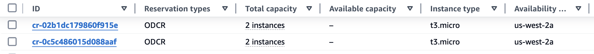

# EKS Cluster with On-demand Capacity Reservations (ODCR)

This pattern demonstrates how to consume/utilize on-demand capacity reservations (ODCRs) with Amazon EKS. The solution is comprised of primarily 3 components:

1. The node group that will utilize the ODCRs should have the subnets provided to it restricted to the availability zone where the ODCR(s) capacity is allocated. For example - if the ODCR(s) are allocated to `us-west-2b`, the node group should only have subnet IDs provided to it that reside in `us-west-2b`. If the subnets that reside in other AZs are provided, its possible to encounter an error such as `InvalidParameterException: The following supplied instance types do not exist ...`. It is not guaranteed that this error will always be shown, and may appear random since the underlying autoscaling group(s) will provision nodes into different AZs at random. It will only occur when the underlying autoscaling group tries to provision instances into an AZ where capacity is not allocated and there is insufficient on-demand capacity for the desired instance type.

2. A custom launch template is required in order to specify the `capacity_reservation_specification` arguments. This is how the ODCRs are integrated into the node group (i.e. - tells the autoscaling group to utilize the provided capacity reservation(s)).

    !!! info
        By default, the `terraform-aws-eks` module creates and utilizes a custom launch template with EKS managed node groups which means users just need to supply the `capacity_reservation_specification` in their node group definition.

3. A resource group will need to be created for the capacity reservations. The resource group acts like a container, allowing for ODCRs to be added or removed as needed to adjust the available capacity. Utilizing the resource group allows for this additional capacity to be adjusted without any modification or disruption to the existing node group or launch template. As soon as the ODCR has been associated to the resource group, the node group can scale up to start utilizing that capacity.

<b>Links:</b>

- [Tutorial: Launch On-Demand Instances using targeted Capacity Reservations](https://docs.aws.amazon.com/AWSEC2/latest/UserGuide/ec2-fleet-launch-on-demand-instances-using-targeted-capacity-reservations-walkthrough.html)
- [Target a group of Amazon EC2 On-Demand Capacity Reservations](https://aws.amazon.com/blogs/mt/target-a-group-of-amazon-ec2-on-demand-capacity-reservations/)

## Code

```terraform hl_lines="5-8 100-110 130-153"

```

## Deploy

See [here](https://aws-ia.github.io/terraform-aws-eks-blueprints/getting-started/#prerequisites) for the prerequisites and steps to deploy this pattern.

## Validate

1. Navigate to the EC2 console page - on the left hand side, click on `Capacity Reservations`under the `Instances` section. You should see the capacity reservation(s) that have been created similar to the screenshot below. For this example, you can see that `Available capacity` column is empty, which means that the capacity reservations have been fully utilized by the example (as expected).

      ---

      <div align="center">
         
      </div>

      ---

2. Click on one of the capacity reservation IDs to view the details of the capacity reservation. You should see the details of the capacity reservation similar to the screenshot below. For this example, you can see that `Available capacity` is `0 instances`, which means that the capacity reservation has been fully utilized by the example (as expected).

      ---

      <div align="center">
         
      </div>

      ---

## Destroy


