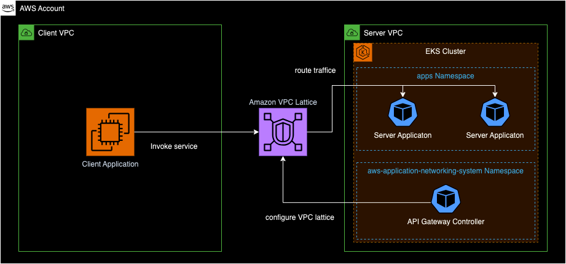

# Amazon VPC Lattice

This pattern demonstrates how to expose an EKS cluster hosted application to an internal consumer through Amazon VPC Lattice.

- [Documentation](https://docs.aws.amazon.com/vpc-lattice/latest/ug/what-is-vpc-lattice.html)
- [AWS Gateway API Controller](https://www.gateway-api-controller.eks.aws.dev/)

## Scenario

With this soluton we showcase how to configure Amazon VPC Lattice using the AWS Gateway API Controller in order to manage Amazon VPC Lattice resources through native K8S Gateway API objects. This pattern deploys two distinct VPCs with a client application running in one of them and a server application in the other. The server application is deployed inside an EKS cluster and made exposed to the client application through Amazon VPC Lattice which establishes connectivity between the two applications. Further we demonstrate how to configure a custom domain name for the exposed service using Amazon Route53 and the external-dns project.




## Deploy

See [here](https://aws-ia.github.io/terraform-aws-eks-blueprints/getting-started/#prerequisites) for the prerequisites and steps to deploy this pattern.

## Validate

In order to test the connectivty between the client and server, please follow the steps outlined below:

1. Login to the management console of your AWS account and navigate to the EC2 service
2. Select your the EC2 Instance with the name **client**, click **Connect**, choose **Session Manager** and click **Connect**
3. Within the console test the connecvity to the server application by entering the following command:

    ```sh
    $ curl -i http://server.example.com
    HTTP/1.1 200 OK
    date: Thu, 14 Dec 2023 08:29:39 GMT
    content-length: 54
    content-type: text/plain; charset=utf-8

    Requesting to Pod(server-6f487b9bcd-5qm4v): server pod

    ```

## Destroy


